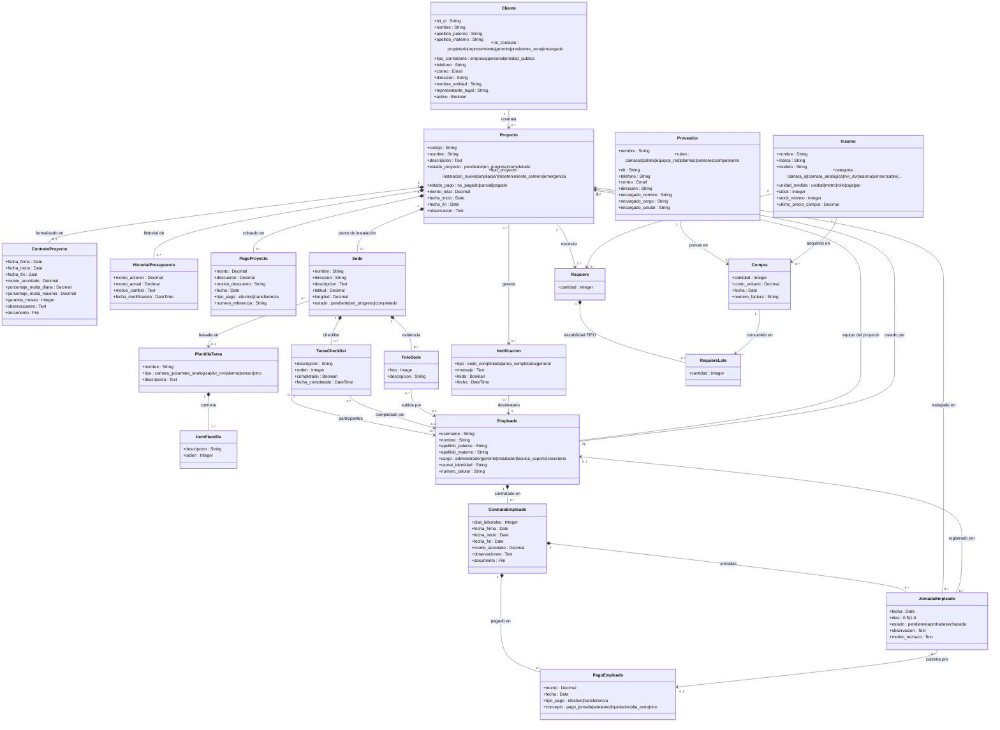

# Diagrama de Contenido UWE — SOBOTEC S.R.L.

## Leyenda

| Símbolo | Significado |
|---|---|
| `*--` | Composición (el hijo no existe sin el padre) |
| `-->` | Asociación / referencia |
| `"1"` `"0..*"` | Multiplicidades |

## Módulos del sistema

| Módulo | Clases de contenido |
|---|---|
| **Proyectos** | Cliente, Proyecto, ContratoProyecto, HistorialPresupuesto, PagoProyecto, Sede, TareaChecklist, FotoSede, PlantillaTarea, ItemPlantilla, Notificacion |
| **Empleados** | Empleado, ContratoEmpleado, PagoEmpleado, JornadaEmpleado |
| **Inventario** | Proveedor, Insumo, Requiere, Compra, RequiereLote |
