# Diagrama de Navegación UWE — SOBOTEC S.R.L.

```mermaid
flowchart TD
    classDef navClass    fill:#dbeafe,stroke:#2563eb,color:#1e3a8a
    classDef indexClass  fill:#dcfce7,stroke:#16a34a,color:#14532d
    classDef queryClass  fill:#fef9c3,stroke:#ca8a04,color:#713f12
    classDef menuClass   fill:#f3e8ff,stroke:#9333ea,color:#4a044e
    classDef actionNode  fill:#fee2e2,stroke:#dc2626,color:#7f1d1d
    classDef entryNode   fill:#e0f2fe,stroke:#0284c7,color:#0c4a6e,font-weight:bold

    %% ══════════════════════════════════════════
    %%  ACCESO PÚBLICO
    %% ══════════════════════════════════════════
    LAND("«navigable»\nLanding"):::entryNode
    AUTH("«navigable»\nIniciar Sesión"):::navClass
    PASS("«navigable»\nCambiar Contraseña"):::navClass

    LAND --> AUTH

    %% ── Redirección por rol tras login ──
    AUTH -->|"admin / gerente / secretaria"| DASH
    AUTH -->|"instalador / técnico soporte"| PROJ_LIST

    %% ══════════════════════════════════════════
    %%  MENÚ PRINCIPAL — Admin / Gerente / Secretaria
    %% ══════════════════════════════════════════
    subgraph MENU_ADMIN["«menu» Navegación Principal"]
        DASH("«navigable»\nDashboard"):::menuClass
        NOTIF("«navigable»\nNotificaciones"):::navClass
        DASH -.->|acceso directo| NOTIF
    end

    DASH -->|"módulo"| PROJ_LIST
    DASH -->|"módulo"| CLI_LIST
    DASH -->|"módulo"| EMP_LIST
    DASH -->|"módulo"| PAY_LIST
    DASH -->|"módulo"| INS_LIST
    DASH -->|"módulo"| PROV_LIST
    DASH -->|"módulo"| COMPRAS_LIST
    DASH -->|"módulo"| REPORTES
    DASH -.->|"perfil"| PASS

    %% ══════════════════════════════════════════
    %%  MÓDULO PROYECTOS
    %% ══════════════════════════════════════════
    subgraph MOD_PROJ["Módulo Proyectos"]
        PROJ_LIST("«index»\nLista de Proyectos"):::indexClass
        PROJ_QUERY{"«query»\nFiltrar Proyectos"}:::queryClass
        PROJ_CREATE("«navigable»\nNuevo Proyecto"):::navClass
        PROJ_DETAIL("«navigable»\nDetalle Proyecto"):::navClass
        PROJ_VIEW("«navigable»\nVista Completa"):::navClass

        PROJ_LIST --> PROJ_QUERY
        PROJ_LIST --> PROJ_CREATE
        PROJ_LIST --> PROJ_DETAIL
        PROJ_DETAIL --> PROJ_VIEW
        PROJ_CREATE --> PROJ_DETAIL

        subgraph SEDES["Sedes de Instalación"]
            SEDE_CREATE("«navigable»\nNueva Sede"):::navClass
            SEDE_EDIT("«navigable»\nEditar Sede"):::navClass
            SEDE_VIEW("«navigable»\nVer Sede / Checklist"):::navClass
        end

        PROJ_DETAIL --> SEDE_CREATE
        PROJ_DETAIL --> SEDE_EDIT
        SEDE_EDIT --> SEDE_VIEW
        SEDE_CREATE --> SEDE_VIEW

        subgraph TAREAS["Checklist de Tareas"]
            TAREA_TOGGLE["«action»\nCompletar / Descompletar\n solo tecnico_soporte"]:::actionNode
            FOTO_UP("«navigable»\nSubir Foto"):::navClass
        end

        SEDE_VIEW --> TAREA_TOGGLE
        SEDE_VIEW --> FOTO_UP

        subgraph CONTRATO_P["Contrato del Proyecto"]
            CP_CREATE("«navigable»\nNuevo Contrato"):::navClass
            CP_DETAIL("«navigable»\nDetalle Contrato"):::navClass
        end

        PROJ_DETAIL --> CP_CREATE
        CP_CREATE --> CP_DETAIL

        subgraph PLANTILLAS["Plantillas de Tareas"]
            PLANT_LIST("«index»\nPlantillas"):::indexClass
            PLANT_CREATE("«navigable»\nNueva Plantilla"):::navClass
            PLANT_DETAIL("«navigable»\nDetalle Plantilla"):::navClass
        end

        DASH --> PLANT_LIST
        PLANT_LIST --> PLANT_CREATE
        PLANT_LIST --> PLANT_DETAIL
    end

    %% ══════════════════════════════════════════
    %%  MÓDULO CLIENTES
    %% ══════════════════════════════════════════
    subgraph MOD_CLI["Módulo Clientes"]
        CLI_LIST("«index»\nLista de Clientes"):::indexClass
        CLI_QUERY{"«query»\nBuscar Cliente"}:::queryClass
        CLI_CREATE("«navigable»\nNuevo Cliente"):::navClass
        CLI_DETAIL("«navigable»\nDetalle Cliente"):::navClass
        CLI_VIEW("«navigable»\nVista Cliente"):::navClass

        CLI_LIST --> CLI_QUERY
        CLI_LIST --> CLI_CREATE
        CLI_LIST --> CLI_DETAIL
        CLI_DETAIL --> CLI_VIEW
    end

    %% ══════════════════════════════════════════
    %%  MÓDULO EMPLEADOS
    %% ══════════════════════════════════════════
    subgraph MOD_EMP["Módulo Empleados"]
        EMP_LIST("«index»\nLista de Empleados"):::indexClass
        EMP_CREATE("«navigable»\nNuevo Empleado"):::navClass
        EMP_DETAIL("«navigable»\nDetalle Empleado"):::navClass
        EMP_VIEW("«navigable»\nVista Empleado"):::navClass
        EMP_CARGA("«navigable»\nCarga de Trabajo"):::navClass
        EMP_REPORT("«navigable»\nReporte Empleado"):::navClass

        EMP_LIST --> EMP_CREATE
        EMP_LIST --> EMP_DETAIL
        EMP_DETAIL --> EMP_VIEW
        EMP_LIST --> EMP_CARGA
        EMP_LIST --> EMP_REPORT

        subgraph CONTRATO_E["Contrato de Empleado"]
            CE_CREATE("«navigable»\nNuevo Contrato"):::navClass
            CE_DETAIL("«navigable»\nDetalle Contrato"):::navClass
        end

        EMP_DETAIL --> CE_CREATE
        CE_CREATE --> CE_DETAIL

        subgraph JORNADAS["Jornadas"]
            JOR_CREATE("«navigable»\nRegistrar Jornada"):::navClass
            JOR_DETAIL("«navigable»\nDetalle Jornada"):::navClass
            JOR_REVISION("«navigable»\nRevisión Jornadas\nde Proyecto"):::navClass
            JOR_APROBAR["«action»\nAprobar / Rechazar\nsolo admin"]:::actionNode
        end

        CE_DETAIL --> JOR_CREATE
        CE_DETAIL --> JOR_DETAIL
        JOR_DETAIL --> JOR_APROBAR
        PROJ_DETAIL --> JOR_REVISION

        subgraph PAGOS_EMP["Pagos a Empleados"]
            PEMP_LIST("«index»\nLista de Pagos"):::indexClass
            PEMP_CREATE("«navigable»\nNuevo Pago"):::navClass
            PEMP_DETAIL("«navigable»\nDetalle Pago"):::navClass
        end

        DASH --> PEMP_LIST
        CE_DETAIL --> PEMP_CREATE
        PEMP_CREATE --> PEMP_DETAIL
        PEMP_LIST --> PEMP_DETAIL
    end

    %% ══════════════════════════════════════════
    %%  MÓDULO PAGOS DEL PROYECTO
    %% ══════════════════════════════════════════
    subgraph MOD_PAY["Módulo Pagos Proyecto"]
        PAY_LIST("«index»\nLista de Pagos"):::indexClass
        PAY_QUERY{"«query»\nFiltrar por Proyecto"}:::queryClass
        PAY_CREATE("«navigable»\nNuevo Pago"):::navClass
        PAY_DETAIL("«navigable»\nDetalle Pago"):::navClass
        PAY_VIEW("«navigable»\nVista Pago"):::navClass
        PAY_ANALYSIS("«navigable»\nAnálisis de Pagos"):::navClass

        PAY_LIST --> PAY_QUERY
        PAY_LIST --> PAY_CREATE
        PAY_LIST --> PAY_DETAIL
        PAY_DETAIL --> PAY_VIEW
        PAY_LIST --> PAY_ANALYSIS
    end

    %% ══════════════════════════════════════════
    %%  MÓDULO INVENTARIO
    %% ══════════════════════════════════════════
    subgraph MOD_INV["Módulo Inventario"]
        INS_LIST("«index»\nLista de Insumos"):::indexClass
        INS_CREATE("«navigable»\nNuevo Insumo"):::navClass
        INS_DETAIL("«navigable»\nDetalle Insumo"):::navClass
        INS_VIEW("«navigable»\nVista Insumo"):::navClass

        INS_LIST --> INS_CREATE
        INS_LIST --> INS_DETAIL
        INS_DETAIL --> INS_VIEW

        subgraph REQUIERE["Insumos por Proyecto"]
            REQ_CREATE("«navigable»\nAsignar Insumo"):::navClass
            REQ_DETAIL("«navigable»\nDetalle Asignación"):::navClass
            QR_INS("«navigable»\nQR Insumo"):::navClass
        end

        PROJ_DETAIL --> REQ_CREATE
        REQ_CREATE --> REQ_DETAIL
        REQ_DETAIL --> QR_INS

        PROV_LIST("«index»\nLista de Proveedores"):::indexClass
        PROV_CREATE("«navigable»\nNuevo Proveedor"):::navClass
        PROV_DETAIL("«navigable»\nDetalle Proveedor"):::navClass

        PROV_LIST --> PROV_CREATE
        PROV_LIST --> PROV_DETAIL

        COMPRAS_LIST("«index»\nLista de Compras"):::indexClass
        COMPRA_CREATE("«navigable»\nNueva Compra"):::navClass
        COMPRA_DETAIL("«navigable»\nDetalle Compra"):::navClass

        COMPRAS_LIST --> COMPRA_CREATE
        COMPRAS_LIST --> COMPRA_DETAIL
    end

    %% ══════════════════════════════════════════
    %%  REPORTES
    %% ══════════════════════════════════════════
    subgraph REPORTES["Reportes y Análisis"]
        REP_PROJ("«navigable»\nAnálisis de Proyectos"):::navClass
        REP_PDF("«navigable»\nReporte PDF Proyectos"):::navClass
        REP_INV("«navigable»\nReporte Inventario"):::navClass

        REP_PROJ --> REP_PDF
    end

    DASH --> REP_PROJ
    DASH --> REP_INV

    %% ══════════════════════════════════════════
    %%  NAVEGACIÓN CAMPO (Instalador / Técnico Soporte)
    %% ══════════════════════════════════════════
    subgraph MOD_CAMPO["Navegación Campo — Instalador / Técnico Soporte"]
        MI_TRABAJO("«navigable»\nMi Trabajo\nDashboard Campo"):::menuClass
        CAMPO_SEDE_VIEW("«navigable»\nVer Sede / Checklist"):::navClass
        CAMPO_JOR_CREATE("«navigable»\nRegistrar Jornada"):::navClass
        CAMPO_JOR_DETAIL("«navigable»\nDetalle Jornada"):::navClass
        CAMPO_TOGGLE["«action»\nCompletar Tarea\n solo tecnico_soporte"]:::actionNode

        MI_TRABAJO --> CAMPO_SEDE_VIEW
        MI_TRABAJO --> CAMPO_JOR_CREATE
        MI_TRABAJO --> CAMPO_JOR_DETAIL
        CAMPO_SEDE_VIEW --> CAMPO_TOGGLE
    end

    PROJ_LIST --> MI_TRABAJO
```

## Leyenda de estereotipos UWE

| Color | Estereotipo | Descripción |
|---|---|---|
| Azul | `«navigable»` | Página de contenido navegable |
| Verde | `«index»` | Lista / índice de objetos |
| Amarillo | `«query»` | Búsqueda o filtro |
| Violeta | `«menu»` | Punto de entrada o menú principal |
| Rojo | `«action»` | Acción sin página de retorno (AJAX / redirección) |

## Control de acceso por rol

| Módulo / Nodo | admin | gerente | secretaria | tecnico_soporte | instalador |
|---|:---:|:---:|:---:|:---:|:---:|
| Dashboard | ✓ | ✓ | ✓ | — | — |
| Mi Trabajo | ✓ | ✓ | — | ✓ | ✓ |
| Proyectos (ver lista) | ✓ | ✓ | ✓ | ✓ | ✓ |
| Proyectos (crear/editar) | ✓ | ✓ | ✓ | — | — |
| Sedes (ver / checklist) | ✓ | ✓ | — | ✓ | ✓ |
| **Completar tarea** | ✓ | ✓ | — | **✓** | **—** |
| Clientes | ✓ | ✓ | ✓ | — | — |
| Empleados | ✓ | ✓ | — | — | — |
| Jornadas (registrar) | ✓ | ✓ | — | ✓ | ✓ |
| Jornadas (aprobar) | ✓ | ✓ | — | — | — |
| Pagos Proyecto | ✓ | ✓ | ✓ | — | — |
| Pagos Empleado | ✓ | ✓ | — | — | — |
| Inventario | ✓ | ✓ | ✓ | — | — |
| Reportes | ✓ | ✓ | ✓ | — | — |
